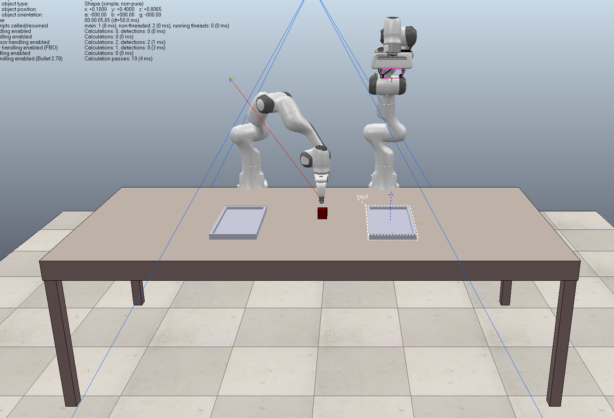
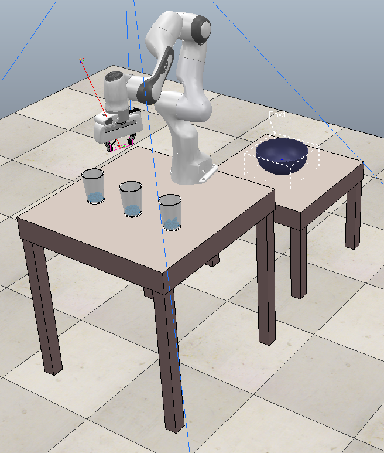
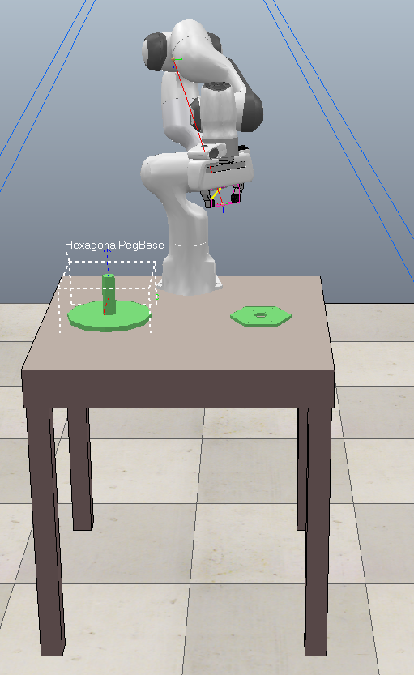
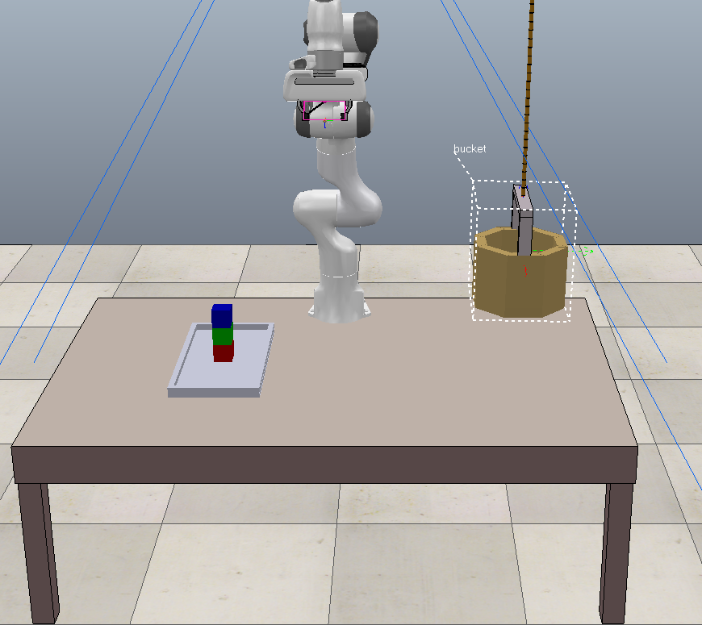

# ProbRobScene

Implementation of the ProbRobScene language outlined in [ProbRobScene: A Probabilistic Specification Language for 3D Robotic Manipulation Environments](https://arxiv.org/abs/2011.01126). Parser for the specifier syntax builds upon the [Scenic-Language](https://github.com/BerkeleyLearnVerify/Scenic) for autonomous driving.

Wrapper included for the [Coppelia-Sim](https://www.coppeliarobotics.com/) simulator using [PyRep](https://github.com/stepjam/PyRep).

## Setup / Running

### Raw Visualization 

To sample from a raw scenario and just visualize the samples in matplotlib, run

```
python runScenarioRaw <scenarios/scenario-file> <max_generations>
```


### CoppeliaSim Simulator

To run an example in simulation: First, make sure you have the latest version of [Coppellia-Sim](https://www.coppeliarobotics.com/) installed.

Next, install [PyRep](https://github.com/stepjam/PyRep) by [following the instructions on their repository](https://github.com/stepjam/PyRep).

NOTE: for some combinations of CoppeliaSim + PyRep, users have reported getting the error:

```
ImportError: libcoppeliaSim.so.1: cannot open shared object file: No such file or directory
```

A workaround for this is to create a soft-link. Go to your Coppellia-Sim root and type:

```
ln -s libcoppeliaSim.so libcoppeliaSim.so.1
```

To run a scenario in CoppeliaSim, along with example robot controller from the paper, try:

```
python coppeliaTest.py
```

## Example scenarios __(TODO: IN PROGRESS)__:
 
#### `scenarios/tableCube`

Dual arms mounted on desk with assorted cubes.

 

#### `scenarios/cupPour` 

Table of cups filled with liquid. Another table with bowl for transfer.



#### `scenarios/gearInsert`

A gear with hole in it, and a a peg to insert it on.

 


#### `scenarios/swingingBucket`

A table with stacked cubes which need to be put into a wobbly swinging basket.




#### `scenarios/rotationRestuarant`

A stacked plate on a rotating sushi conveyor belt must be picked up and placed on a dining table.


