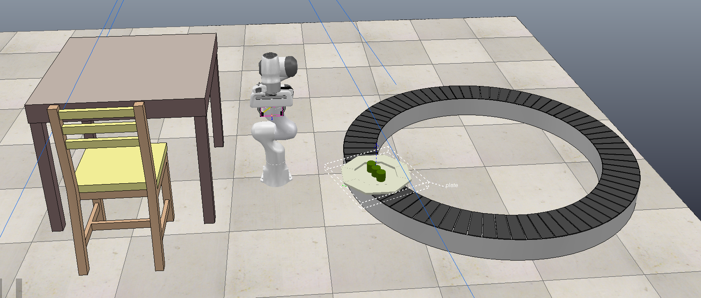

# ProbRobScene

Implementation of the ProbRobScene language, along with wrapper for
[Coppelia-Sim](https://www.coppeliarobotics.com/) simulator.

Example scenarios in scenarios/ folder are (TODO: in progress):
 
#### `tableCube`

Dual arms mounted on desk with assorted cubes.

 

#### `cupPour` 

Table of cups filled with liquid. Another table with bowl for transfer.


#### `gearInsert`

A gear with hole in it, and a a peg to insert it on.

 


### `swingingBucket`

A table with stacked cubes which need to be put into a wobbly swinging basket.


### `rotationRestuarant`

A stacked plate on a rotating sushi conveyor belt must be picked up and placed on a dining table.



## Setup / Running

First, make sure you have the latest version of [Coppellia-Sim](https://www.coppeliarobotics.com/) installed.

Next, install [PyRep](https://github.com/stepjam/PyRep), either by [following the instructions on their repository](https://github.com/stepjam/PyRep), or with:

```
pip install pyrep
```

To sample from a raw scenario and just visualize the samples in matplotlib, run

```
python runScenarioRaw <scenarios/scenario-file> <max_generations>
```

To run a scenario in coppeliaSim, along with example robot controller from the paper, try:

```
python coppeliaTest.py
```